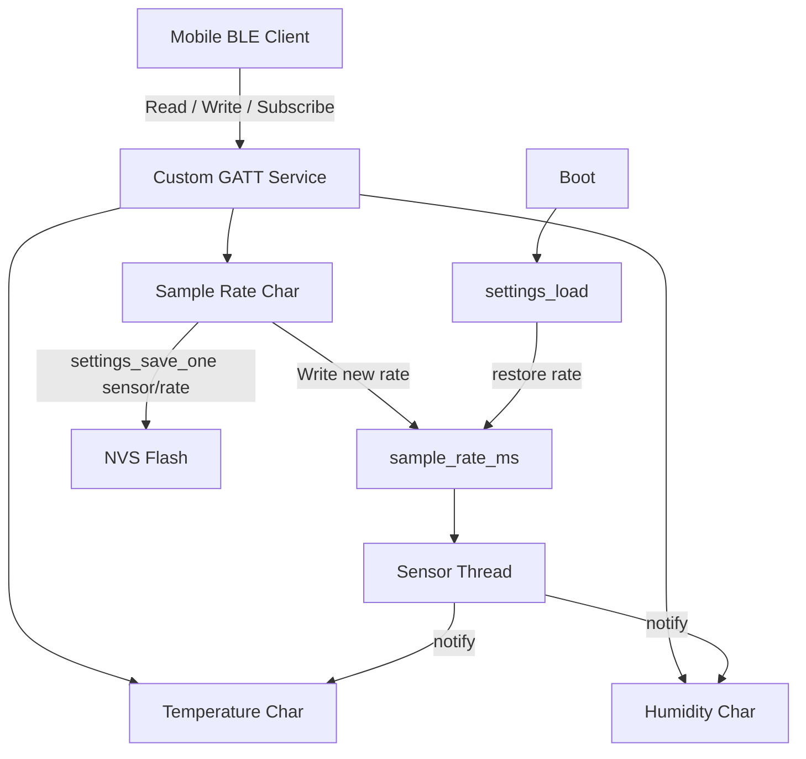
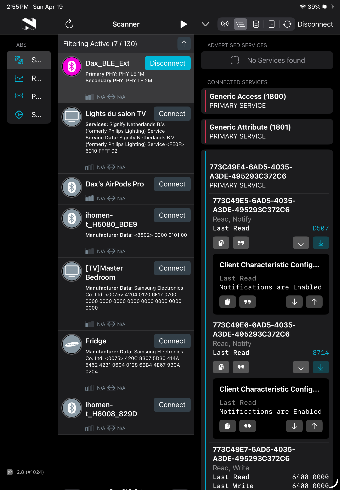
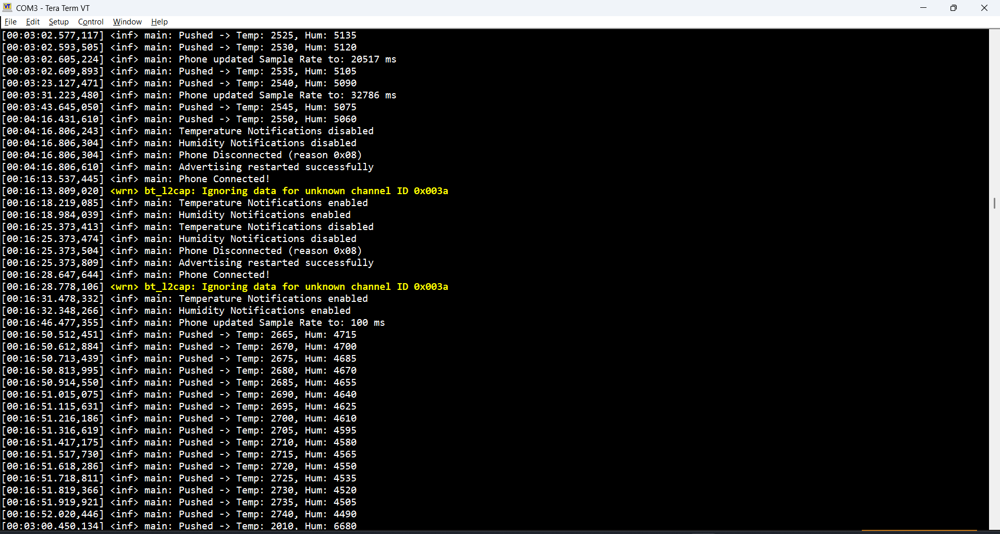

# Dax BLE Sensor Node

[](https://www.zephyrproject.org/)
[](https://www.nordicsemi.com/Products/Development-hardware/nrf52840-dk)
[](https://en.wikipedia.org/wiki/C_(programming_language))
[](https://www.bluetooth.com/learn-about-bluetooth/tech-overview/)

BLE peripheral firmware for `nrf52840dk/nrf52840` built with Zephyr RTOS.  
Implements a custom 128-bit GATT service for sensor telemetry and runtime configuration, including flash-backed settings persistence.

## Features

- Custom BLE service with:
  - Temperature characteristic (`read`, `notify`)
  - Humidity characteristic (`read`, `notify`)
  - Sampling interval characteristic (`read`, `write`)
- Extended advertising + automatic re-advertise on disconnect
- Background RTOS sensor update thread
- Per-characteristic CCC notification control
- Persistent sample rate using Zephyr Settings + NVS (`sensor/rate`)
- Startup-time error checks for BLE and settings initialization

## Hardware / Software

- Board: `nRF52840-DK` (PCA10056)
- SDK/RTOS: Zephyr (NCS-compatible)
- Language: C
- Flash backend: NVS

## Repository Layout

- `src/main.c` - BLE service definition, callbacks, sensor thread, settings handler, app entrypoint
- `prj.conf` - Zephyr Kconfig options
- `CMakeLists.txt` - Application CMake target
- `native_sim_native_64.overlay` - Optional native simulation overlay

## Architecture



## Quick Start

### 1) Build

```powershell
west build -b nrf52840dk/nrf52840 -p always
```

### 2) Flash

```powershell
west flash -d build -r nrfjprog --snr 1050292656
```

## Demo

BLE service and characteristics in nRF Connect:



UART runtime logs in Tera Term:



## Validate Persistence

1. Connect from a BLE client (e.g. nRF Connect mobile).
2. Write sample-rate characteristic to `500` (ms).
3. Reset/power-cycle the board.
4. Confirm log message:

```text
Loaded sample rate: 500 ms
```

## UART Logs (Tera Term)

Open the DK virtual COM port with:

- Baud: `115200`
- Data bits: `8`
- Parity: `None`
- Stop bits: `1`
- Flow control: `None`

## Notes

- If flashing via `nrfutil` fails, use `-r nrfjprog`.
- If `nrfjprog` is missing, install nRF Command Line Tools and add its `bin` to `PATH`.
- If J-Link errors (`JLinkARM.dll -256`) appear, update SEGGER J-Link and reconnect via the DK `DEBUG` USB port.

